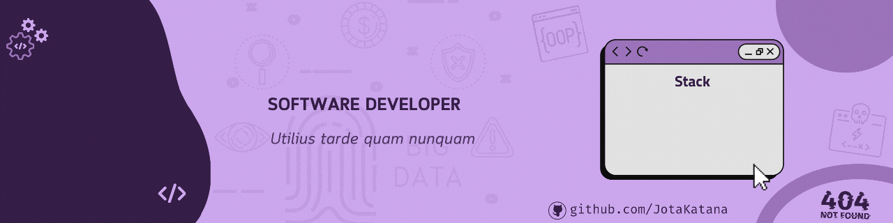

<h2 align="center"> 
	🚧  Estudo Java ♻️ Calculadora Simples 🚀 🚧
</h2>

 <a href="#-sobre-o-projeto">Sobre</a> •
 <a href="#-funcionalidades">Funcionalidades</a> •
 <a href="#-layout">Layout</a> • 
 <a href="#-como-executar-o-projeto">Como executar</a> • 
 <a href="#-tecnologias">Tecnologias</a> • 
 <a href="#-autor">Autor</a> • 
 <a href="#user-content--licença">Licença</a>

## 📄 Descrição do entregável

- .\src\Main.java (Arquivo do código desenvolvido) 

---

## 💻 Sobre o projeto

Este projeto é voltado na utilização de autodesenvolvimento em java, projeto com intuito de utilizar valores optidos de um cliente que vai receber valores em decimais (double - escolhido pois não tenho necessidade de usar pouca carga de bytes), os valores obtidos vão ser utilizados pela maquina e resultaram em alguma contas aritimeticas simples. Resultando assim em resultado de Soma, Subtração, Divisão, Multiplicação, Raiz do Numero 1 e Raiz do numero 2.

---

## ⚙️ Funcionalidades

- [x] Coleta de valores numéricos decimais
- [X] Resultado em contas aritmeticas básicas
---

## 🎨 Layout

- [X] Resultado:

---

## 🚀 Como executar o projeto

1 - Baixar o Projeto  
2 - Rodar o arquivo

### Pré-requisitos

Antes de começar, você vai precisar ter instalado em sua máquina as seguintes ferramentas:
[Git](https://git-scm.com).
Além disto é bom ter um editor para trabalhar com o código como [IntellIJ IDEA](https://www.jetbrains.com/pt-br/idea/) ou [Semelhante]

---

## 🛠 Tecnologias

A seguinte linguagem de programação foi usada na construção do projeto:

---

## 💪 Como contribuir para o projeto\

1. Faça um **fork** do projeto.
2. Crie uma nova branch com as suas alterações: `git checkout -b my-feature`
3. Salve as alterações e crie uma mensagem de commit contando o que você fez: `git commit -m "feature: My new feature"`
4. Envie as suas alterações: `git push origin my-feature`

---

## 🦸 Autor

  

---

## 📝 Licença

Este projeto esta sobe a licença [MIT](./LICENSE).

